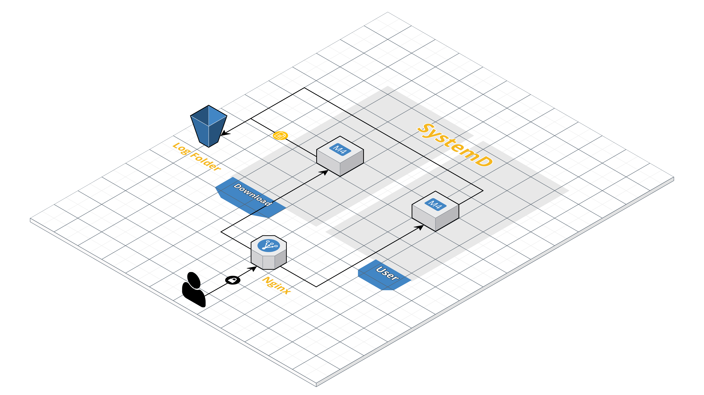

### TP3 Sistemas Operativos II
## Ingeniería en Compuatación - FCEFyN - UNC
# Sistemas Embebidos

## Introducción
Los _sistemas embebidos_ suelen ser accedidos de manera remota. Existen distintas tenicas para hacerlo, una forma muy utilizada suelen ser las _RESTful APIs_. Estas, brindan una interfaz definida y robusta para la comunicación y manipulación del _sistema embebido_ de manera remota. Definidas para un esquema _Cliente-Servidor_ se utilizan en todas las verticales de la industria tecnológica, desde aplicaciones de _IoT_ hasta juegos multijugador.

## Objetivo
El objetivo del presente trabajo práctico es que el estudiante tenga un visión _end to end_ de una implementación básica de una _RESTful API_ sobre un _sistema embedido_.
El estudiante deberá implementarlo interactuando con todas las capas del procesos. Desde el _testing_ funcional (alto nivel) hasta el código en C del servicio (bajo nivel).

## Desarrollo
### Requerimientos
Para realizar el presente trabajo practico, es necesario una computadora con _kernel_ GNU/Linux, ya que usaremos [SystemD][sysD] para implementar el manejo de nuestro servicios.

### Desarrollo
Se deberá implementar dos servicios en lenguaje C, estos son el _servicio de usuarios_ y el _servicio de descarga_. Cada servicio deberá exponer una _REST API_. Con el objetivo de acelerar el proceso de desarrollo vamos a utilizar un _framework_: se propone utilizar [ulfius][ulfi]. El estudiante puede seleccionar otro, justificando la selección, o implementar el propio (no recomendado).
El servicio debe tener configurado un [nginx][ngnx] por delante para poder direccionar el _request_ al servicio correspondiente.
El web server, deberá autenticar el _request_ por medio de de un usuario y password enviado en el _request_, definido donde el estudiante crea conveniente. Las credenciales no deberán ser enviadas a los servicios. 

El web server deberá  retornar _404 Not Found_ para cualquier otro _path_ no existente.

A modo de simplificación, usaremos sólo _HTTP_, pero aclarando que esto posee *graves problemas de seguridad*.
Todos los servicios deben estar configurados con _SystemD_ para soportar los comandos, _restart_, _reload_, _stop_, _start_ y deberán ser inicializados de manera automática cuando el sistema operativo _botee_.

Los servicios deber _logear_ todas sus peticiones con el siguiente formato:

```sh
    <Timestamp> | <Nombre Del Servicio> | <Mensaje>
```

El _\<Mensaje\>_ sera definido por cada una de las acciones de los servicios.

El gráfico \ref{fig:arq} se describe la arquitectura requerida.





A continuación, detallaremos los dos servicios a crear y las funcionalidades de cada uno.

### Servicio de Usuarios
Este servicio se encargará de crear usuarios y listarlos. Estos usuarios deberán poder _logearse_ vía _SSH_ luego de su creación.

#### POST /api/users
Endpoints para la creación de usuario en el sistema operativo:

```C
    POST http://{{server}}/api/users
```
Request
```C    
        curl --request POST \
            --url http:// {server}}/api/users \
            -u USER:SECRET \
            --header 'accept: application/json' \
            --header 'content-type: application/json' \
            --data '{"username": "myuser", "password": "mypassword"}'
```
Respuesta
```C

        {
            "id": 142,
            "username": "myuser",
            "created_at": "2019-06-22 02:19:59"
        }

```
El _\<Mensaje\>_ para el log será: _Usuario \<Id\> creado_
  
#### GET /api/users
Endpoint para obtener todos los usuario del sistema operativo y sus identificadores.
```C
    GET http://{{server}}/api/users
```
Request
```C
    curl --request GET \
        --url http://{{server}}/api/users \
        -u USER:SECRET \
        --header 'accept: application/json' \
        --header 'content-type: application/json'
```
Respuesta
```C
    {
      "data": [
          {
              "user_id": 2,
              "username": "user1",  
          },
          {
              "user_id": 1,
              "username": "user2"
          },
          ...
      ]
    }
```
El  _\<Mensaje\>_ para el log será:  _Usuario listados: \<cantidad de usuario del SO\>_
 
### Servicio de descarga
Este servicio pondra en disposición links de descarga de archivos de GOES. Ante la peticion de un usuario (POST), si el archivo solicitado ya ha sido descargado con anterioridad, se le avisa al suario que ya existe y se envia el link. Ante la peticion de un usuario de un archivo que no ha sido descargado, se debe avisar al usuario que no existe y que se debe descargar, se descarga de AWS S3 el archivo peticionado (en bakcground) y se avisa al usuario una vez que ha sido descargado. En ambos casos, la respuesta siempre es se debe retornar el link de descarga del tipo _http://{{server}}/data/filename_, de donde el usuario pordrá obtener el o los archivos.

#### POST /api/servers/get_goes
```C
    POST http://{{server}}/api/servers/get_goes
```
Request

```C
    curl --request POST \
        --url http://{{server}}/api/servers/get_goes \
        -u USER:SECRET \
        --header 'accept: application/json' \
        --header 'content-type: application/json'
        --data '{"product": "OR_ABI-L2-MCMIPF", "datetime": "Y%m%d%h"}
```

Respuesta
```C
    {
    "files": [
          {
              "file_id": 1
              "link": "http://{{server}}/data/OR_ABI-L2-MCMIPF-M6_G16_s20210661636116_e20210661638489_c20210661638589.nc",
              "filesize": "345 kb"  
          },
          ...
          {
              "file_id": n,
              "link": "http://{{server}}/data/OR_ABI-L2-MCMIPF-M6_G16_s20210661634116_e20210661648489_c20210661648589.nc",
              "filesize": "4,5 T"
          },
    }
```

El formato del campo _datetime_, deve ser definido por ustedes, pero debe conetenr año, día juliano y hora. El archivo a descargar será el primer arcvhivo de cada hora.
El log tendrá dos partes:
 -  _Archivos descargados nuevos: \<cantidad de archivos descargados nuevos\>_
 -  _Archivos descargados preexistentes: \<cantidad de descargados preexistentes\>_
    
#### GET /api/servers/get_goes
Este endpoint perimte al usuario conocer la lista de archivos que hay en el server
```C
    GET http://{{server}}/api/servers/get_goes
```
Request
```C
    curl --request GET \
        --url http://{{server}}api/servers/get_goes \
        -u USER:SECRET \
        --header 'accept: application/json' \
        --header 'content-type: application/json'
```
Respuesta
```C
    {
    "files": [
          {
              "file_id": 1
              "link": "http://{{server}}/data/OR_ABI-L2-MCMIPF-M6_G16_s20210661636116_e20210661638489_c20210661638589.nc",
              "filesize": "345 kb"  
          },
          ...
          {
              "file_id": n,
              "link": "http://{{server}}/data/OR_ABI-L2-MCMIPF-M6_G16_s20210661634116_e20210661648489_c20210661648589.nc",
              "filesize": "4,5 T"
          },
    }
```

El _\<Mensaje\>_ para el log será: _ Archivos en el server: \<cantidad de archivos en el server\>_.
    

 
## Entrega
Se deberá proveer los archivos fuente, así como cualquier otro archivo asociado a la compilación, archivos de proyecto "Makefile" y el código correctamente documentado, todo en el repositorio, donde le Estudiante debe demostrar avances semana a semana mediante _commits_.

También se debe entregar un informe, guia tipo _How to_, explicando paso a paso lo realizado (puede ser un _Markdown_). El informe además debe contener el diseño de la solución con una explicacion detallada de la misma. Se debe asumir que las pruebas de compilación se realizarán en un equipo que cuenta con las herramientas típicas de consola para el desarrollo de programas (Ejemplo: gcc, make), y NO se cuenta con herramientas "GUI" para la compilación de los mismos (Ej: eclipse).

El install del makefile deberá copiar los archivos de configuración de systemd para poder luego ser habilitados y ejecutados por linea de comando.
El script debe copiar los archivos necesarios para el servicio Nginx systemd para poder luego ser habilitados y ejecutados por linea de comando.
Los servicios deberán pasar una batería de test escritas en _postman_ provistas. TBD.

### Criterios de Corrección
- Se debe compilar el código con los flags de compilación: 
     -Wall -Pedantic -Werror -Wextra -Wconversion -std=gnu11
- La correcta gestion de memoria.
- Dividir el código en módulos de manera juiciosa.
- Estilo de código.
- Manejo de errores
- El código no debe contener errores, ni warnings.
- El código no debe contener errores de cppcheck.


## Evaluación
El presente trabajo práctico es individual deberá entregarse antes del jueves 3 de junio de 2021 a las 23:55 mediante el LEV.  Será corregido y luego deberá coordinar una fecha para la defensa oral del mismo.

## Referencias y ayudas
- [Systrem D ](https://systemd.io/)
- [System D en Freedesktop](https://www.freedesktop.org/wiki/Software/systemd/)
- [nginx](https://docs.nginx.com/)
- [Ulfius HTTP Framework](https://github.com/babelouest/ulfius)
- [Kore Web PLataform](https://kore.io/)

[sysD]: https://www.freedesktop.org/wiki/Software/systemd/
[ngnx]: https://docs.nginx.com/
[ulfi]: https://github.com/babelouest/ulfius
