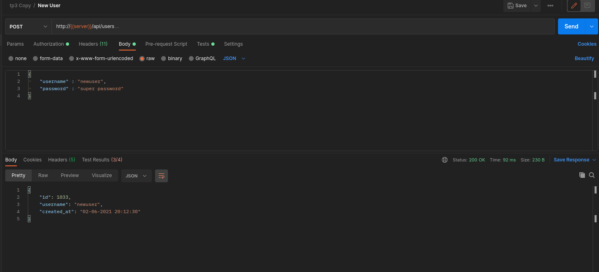
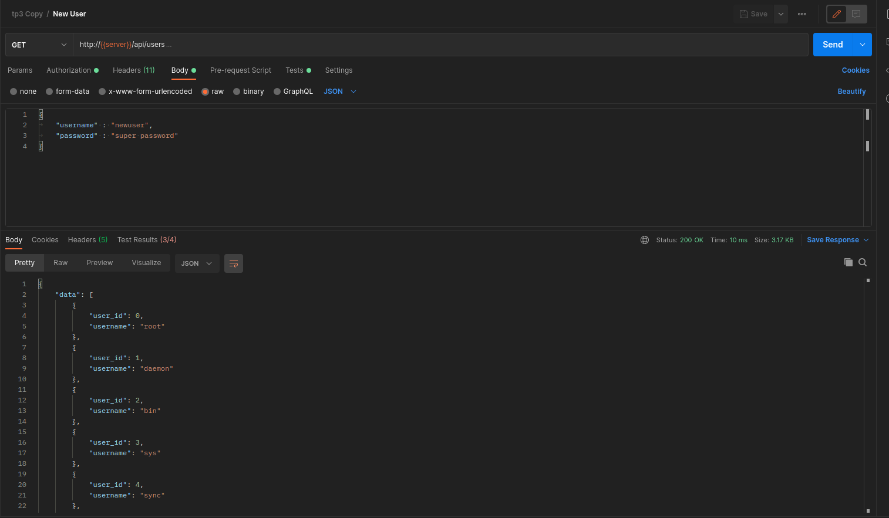
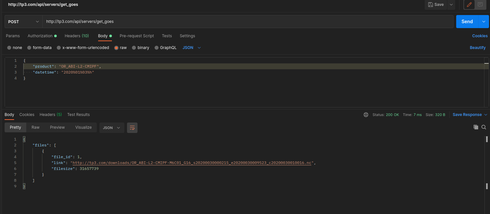
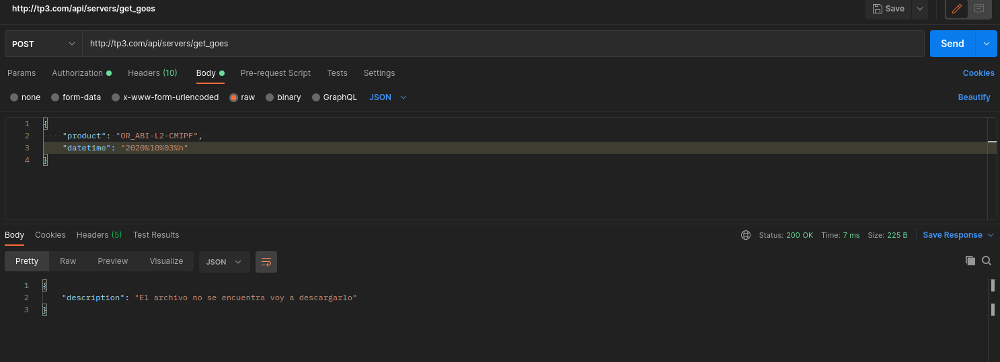
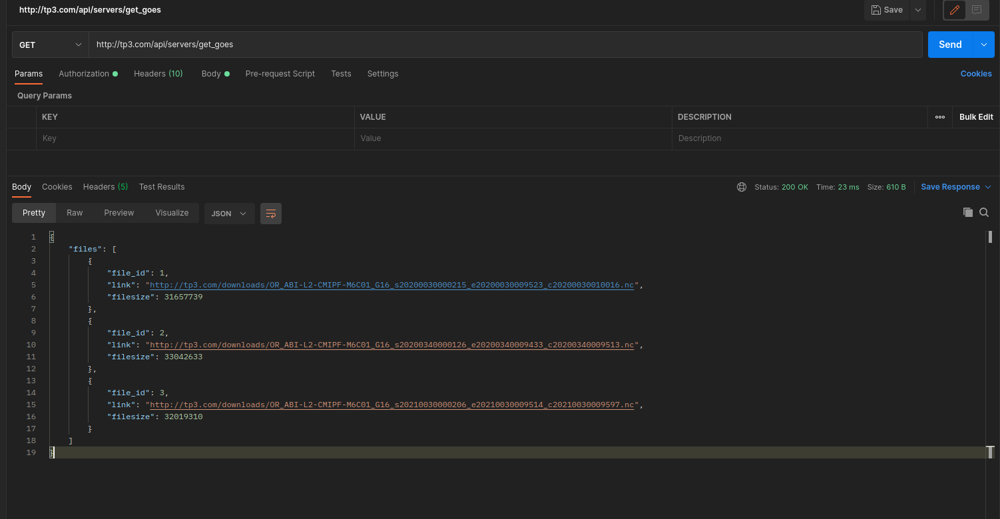
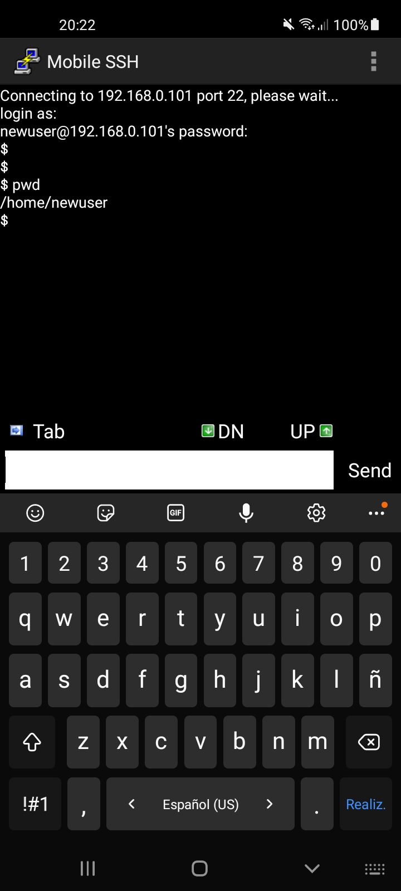

TP3 Sistemas Operativos 2 
### Ingeniería en Computación - FCEFyN - UNC - Lucas Antonio Salse
# Sistemas embebidos

## Introducción
El objetivo del presente trabajo práctico es que el estudiante tenga un visión end to end de una implementación básica de una RESTful API sobre un sistema embedido. Se  buscará implementarlo interactuando con todas las capas del procesos. Desde el testing funcional (alto nivel) hasta el código en C del servicio (bajo nivel).

## Ubicación proyecto
- El proyecto se encuentra en el directorio **src**, donde se tiene el arcivo goes_service.c, user_service.c, utilidades.c y utilidades.h con su correspondiente makefile
- El informe esta en el directorio **informe** junto con las imagenes empleadas en el mismo.
- En el directorio **systemd_services** se encuentran los archivos necesarios para correr los servicios mediante systemd como así tambien la configuración del nginx.

## Diseño e implementación
### Creación del servicio user_service.c
Para poder implementar lo solicitado se procedió a la creación de un .c llamado user_service.c. Este archvio será en encargado mediante la utilización del *framework* **Ulfius** de poder generar el servicio correspondiente. En un primer momento para poder comprender el funcionamiento del mismo se utilizó el ejemplo brindado por Ulfius. Sobre ese mismo ejemplo una vez entendido su funcionamiento se comenzó la modificación para adaptarlo a lo pedido.
#### Método POST/api/users
Este endpoint es el que se encarga de la creación de usuarios al sistema operativo, mediante el request enviado por el usuario. Se procede en obtener de dicho request tanto el **"username"** como el **"password"**, luego posteriormente se emplean dichos campos para generar mediante el comando ***useradd*** la creación del usuario. En un primer momento se empleo solamente el comando con la flag -p, esto genero que la contraseña se encontraba encriptada y no era posible poder obtener cual era. Por esta razón se cambio ese comando y se empleo un comando de perl.
Luego de la creación del usuario se registra dicho evento en un log y se responde al cliente con el json correspondiente.
##### Resultados:

*Figura 1: Creación de un nuevo usuario*

#### Método GET/api/users
Para poder obtener el listado de usuarios, se implemento una función llamada *get_users()*, que devuelve un objeto json con la información requerida para cada uno de los usuarios.
Esta función es llamada en el callback del framework, que se va a ejecutar cada vez que el servicio recibe un request de un método GET. Luego de esto se escribe dicho evento en el log.

Para poder escribir en el log con el formato correspondiente, se creo una función llamada *get_time()* la cual nos sirve para obtener el datetime con su correspondiente formato, que será utilizado en la escritura del log.
##### Resultados:

*Figura 2: Obtencion de los usuarios mediante el GET*

### Creación del servicio goes_service.c
Este servicio tiene como objetivo poner a disposición links de descargas de archivos GOES, ante una petición de un usuario POST, si el archivo solicitado ya ha sido descargada con anterioridad, se envía el link correspondiente de manera automática, de no serlo se procede a iniciar una descarga y se avísa que se va a iniciar la descarga del correspondiente archvio.
#### POST /api/servers/get_goes
Para cumplir con este requerimiento una vez que se produce el POST y el archivo no se encuentra descargado se inicia la descarga mediante un nuevo hilo, el cual es el encargado de generar los comandos correspondientes de la cli de aws para obtener el primer file del producto en base a la fecha solicitada, se busco que un hilo se encargue exlusivamente de realizar esta tarea porque se necesita una respuesta rápida al usuario para comunicarle que su archvio no se encuentra y se iniciará a descargarlo.
Una vez que el archivo empieza a descargarse es almacenado en una lista enlazada de descargas, la cual nos permite saber si un nuevo usuario requiere el mismo archivo que se esta descargando y no iniciar así una nueva descarga. Una vez finalizada la descarga se agrega todos los datos correspondientes (como así también el link)a una lista de archvios disponibles, que es mediante la cual se obtendrá los datos necesarios para responderle al cliente.
##### Resultados:

*Figura 3: Obtencion del link de un archivo ya descargado*

*Figura 4: El archivo no se encuentra se inicia la descarga*
#### Comandos aws
Para poder obtener el primer file correspondiente a lo solicitado por el usuario se empelo el comando: *aws s3 cp s3://noaa-goes16/< product_format >/< year >/ < doy >/00/< file_name > --no-sign-request* donde es necesario convertir previamente el datetime pasado por medio del request a formato doy (day of year) correspondiente.
Para obtener el file_name (primero de dicha fecha y producto) se empleo el siguiente comando: *aws s3 ls noaa-goes16/< product_format >/< year >/ < doy >/00/ --no-sign-request*
#### GET /api/servers/get_goes
Este endpoint permite al usuario conocer la lista de todos los archvios que hay en el server, para esto se creo una función llamada: *get_files(&lista)* que lee la lista de todos los archivos descargados y se los envía al usuario mediante un objeto json.

*Figura 5: Obtencion de los archvios disponibles*

### Systemd
Mediante systemd se procedió a crear los archivos necesarios para habilitar y correr los servicios (binaros de los .c). Los archvios user_service.service y oges_service.service son los encargados de efectuar esto. Estos dos archvios deben encontrarse en el directorio: */etc/systemd/system* y para iniciar los servicios se usan los siguientes comandos: *systemctl enable goes_service.service* y *systemctl start goes_service.service* para cada uno de los servicios.
Para entender el funcionamiento de esto, se efectuo un ejemplo de prueba sencillo que se puede ver en el directorio systemd_ejemplo.
Luego dichos comandos son acregados en el makefile.

### Ngingx
Para la confiugración del archvio server_nginx se utilizo las referencia provista en este informe. El archivo de las configuración se llama **server_nginx** y debe ser copiado en el siguiente directorio: */etc/nginx/sites-available* y crear un link simbolico a: */etc/nginx/sites-enabled/server_nginx*
El root del servidor es: **/var/goes_service** y las descargas de los archvios se efectuan en: ***< root_server >/downloads**.
El nombre de área protegida en el server es debido a que el único usuario el cual puede acceder es el que se encuentra en el registro */etc/apache2/.htpasswd*
Dicho usuario debe ser creado anteriormente para poder acceder al server.
### SSH
Se comprueba que uno de los usuarios creados por el servicio es posible acceder a él mediante ssh:

*Figura 6: Conexión por medio de ssh al usuario creado anteriormente*

## Conclusión
Los requerimientos pedidos fueron cumplidos con éxito: el programa es capaz de efectuar los servicios de manera correspondiente, autenticando el usuario creado en el server. Tambien se busco optimizar la respuesta del servicio de descarga mediante la implementación de un hilo encargado a realizar dicha parte. Se pudo comprobar mediante ssh que los usuarios creados por el servicio user_service funcione de manera correcta.

## Referencias
---
Bibliografia:
- [Nginx](https://www.nginx.com/)
- [Nginx documentation](https://docs.nginx.com/)
- Filminas de clase
- Linux man page

Enlaces:
- [NOAA GOES on AWS (CICS)](https://docs.opendata.aws/noaa-goes16/cics-readme.html)
- [How to get filesize using stat() in C](https://techoverflow.net/2013/08/21/how-to-get-filesize-using-stat-in-cc/)
- [Restricting Access with HTTP Basic Authentication](https://docs.nginx.com/nginx/admin-guide/security-controls/configuring-http-basic-authentication/)
- [password does not work with useradd -p](https://askubuntu.com/questions/668129/password-does-not-work-with-useradd-p)
- [ulfius](https://github.com/babelouest/ulfius)
---

